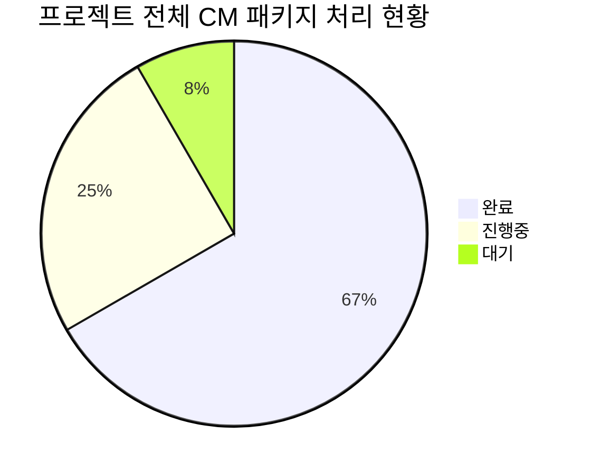
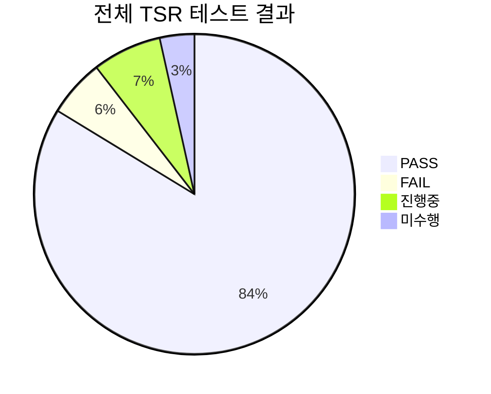
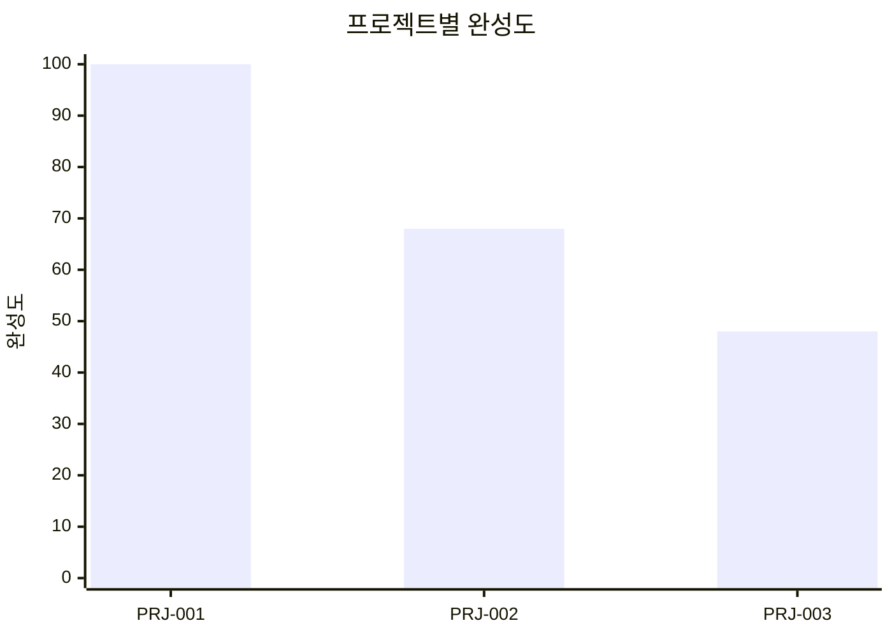
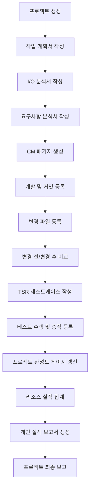

# 프로젝트 CM 패키지 업무 대시보드

> 본 문서는 프로젝트 단위로 CM 패키지, 요구사항 분석, 작업 계획서, I/O 분석서, 개발 변경사항, 커밋 이력, 변경 리소스, TSR 테스트케이스, 업무 공수 및 최종 성과 보고서를 관리하기 위한 Markdown 대시보드입니다.  
> 관리자가 작업한 파일과 커밋 내용을 등록하면 CM 패키지 단위로 변경 전/변경 후, 변경 리소스 수, 테스트 결과, 프로젝트 완성도, 개인 실적 보고서까지 추적할 수 있도록 구성합니다.

---

## 0. 문서 사용 목적

이 문서는 다음 목적을 가집니다.

| 목적 | 설명 |
|---|---|
| 작업량 정량화 | 프로젝트, CM 패키지, 변경 파일, 커밋, 테스트케이스, 공수량을 수치로 관리 |
| 변경 이력 추적 | 파일별 변경 전/변경 후 내용을 CM 패키지 단위로 비교 관리 |
| 리소스 관리 | 변경된 파일 수, 신규/수정/삭제 리소스 수, 영향도 높은 파일 수 확인 |
| 테스트 관리 | TSR 테스트케이스, 증적 캡처, 기기/OS, 테스트 결과 관리 |
| 완성도 시각화 | 프로젝트별 완성도 게이지를 통해 업무 진행률을 한눈에 확인 |
| 성과 보고서 산출 | 프로젝트 완료 후 개인이 수행한 개발, 리소스 처리량, 테스트 결과, 정량 성과를 보고서 형태로 정리 |

---

## 1. 전체 대시보드

### 1.1 프로젝트 전체 현황

| 구분 | 수치 | 설명 |
|---|---:|---|
| 전체 프로젝트 수 | 3개 | 현재 관리 중인 프로젝트 수 |
| 진행 중 프로젝트 | 2개 | 개발 또는 테스트 진행 중 |
| 완료 프로젝트 | 1개 | 최종 반영 및 보고서 작성 완료 |
| 전체 CM 패키지 수 | 12개 | 프로젝트 내 변경관리 단위 |
| 완료 CM 패키지 수 | 8개 | 개발/테스트/증적 완료 기준 |
| 전체 변경 파일 수 | 57개 | 커밋 기준 변경된 리소스 수 |
| 전체 커밋 수 | 24건 | CM 패키지에 연결된 커밋 수 |
| 전체 TSR 테스트케이스 수 | 86건 | 테스트케이스 총합 |
| PASS 테스트케이스 수 | 72건 | 정상 완료 테스트 |
| 총 투입 공수 | 34.5 MD | 분석 + 개발 + 테스트 + 보고 포함 |
| 전체 평균 완성도 | 72% | 프로젝트별 완성도 평균 |

---

### 1.2 프로젝트별 완성도 게이지

| 프로젝트 | 완성도 | 게이지 | 상태 |
|---|---:|---|---|
| PRJ-001 로그인/푸시 안정화 | 100% | `████████████████████ 100%` | 완료 |
| PRJ-002 QR 스캔/EMVCo 파싱 개선 | 68% | `█████████████░░░░░░░ 68%` | 진행중 |
| PRJ-003 eKYC 결과값 정규화 | 48% | `██████████░░░░░░░░░░ 48%` | 진행중 |

---

### 1.3 전체 업무량 통계







---

## 2. 화면 분기 목차

| 화면 | 설명 | 이동 |
|---|---|---|
| 전체 대시보드 | 프로젝트 전체 진행률, CM, TSR, 공수 현황 | [이동](#1-전체-대시보드) |
| 프로젝트 목록 | 프로젝트별 작업 계획서, I/O 분석서, 완성도 확인 | [이동](#3-프로젝트-목록) |
| 프로젝트 상세 | 프로젝트 기준 요구사항, CM 패키지, 완성도 게이지 확인 | [이동](#4-프로젝트-상세) |
| CM 패키지 목록 | 프로젝트 내 변경관리 패키지 목록 확인 | [이동](#5-cm-패키지-목록) |
| CM 패키지 상세 | 요구사항, 개발 내용, 커밋, 변경 리소스 확인 | [이동](#6-cm-패키지-상세) |
| 커밋/파일 변경관리 | 커밋별 파일 변경 전/후 비교 | [이동](#7-커밋-및-파일-변경관리) |
| TSR 테스트케이스 | CM 패키지별 테스트케이스 및 증적 관리 | [이동](#8-tsr-테스트케이스-관리) |
| 리소스 실적 집계 | 최종 반영 기준 리소스 처리량 집계 | [이동](#9-리소스-실적-집계) |
| 개인 실적 보고서 | 프로젝트 완료 후 개인 개발/테스트/성과 보고 | [이동](#10-개인-실적-보고서) |

---

## 3. 프로젝트 목록

| 프로젝트 ID | 프로젝트명 | 상태 | 완성도 | CM 패키지 수 | 변경 파일 수 | TSR 수 | 총 공수 | 상세 |
|---|---|---|---:|---:|---:|---:|---:|---|
| PRJ-001 | 로그인/푸시 안정화 | 완료 | 100% | 4개 | 18개 | 30건 | 12.0 MD | [보기](#41-prj-001-로그인푸시-안정화) |
| PRJ-002 | QR 스캔/EMVCo 파싱 개선 | 진행중 | 68% | 5개 | 26개 | 38건 | 15.5 MD | [보기](#42-prj-002-qr-스캔emvco-파싱-개선) |
| PRJ-003 | eKYC 결과값 정규화 | 진행중 | 48% | 3개 | 13개 | 18건 | 7.0 MD | [보기](#43-prj-003-ekyc-결과값-정규화) |

---

## 4. 프로젝트 상세

### 4.1 PRJ-001 로그인/푸시 안정화

#### 4.1.1 프로젝트 기본 정보

| 항목 | 내용 |
|---|---|
| 프로젝트 ID | PRJ-001 |
| 프로젝트명 | 로그인/푸시 안정화 |
| 프로젝트 리더 | 홍길동 |
| 담당자 | 함성호 |
| 기간 | 2026-06-01 ~ 2026-06-14 |
| 상태 | 완료 |
| 완성도 | 100% |

#### 4.1.2 산출물 현황

| 산출물 | 상태 | 완료율 | 비고 |
|---|---|---:|---|
| 작업 계획서 | 완료 | 100% | 프로젝트 착수 시 작성 |
| I/O 분석서 | 완료 | 100% | API/푸시 Payload 영향도 분석 |
| 요구사항 분석서 | 완료 | 100% | 요구사항 6건 정리 |
| CM 패키지 | 완료 | 100% | 4개 완료 |
| TSR 테스트케이스 | 완료 | 100% | 30건 PASS |
| 최종 실적 보고서 | 완료 | 100% | 리더 보고 완료 |

#### 4.1.3 완성도 게이지

`████████████████████ 100%`

#### 4.1.4 프로젝트 구성 CM 패키지

| CM 패키지 번호 | 제목 | 상태 | 변경 파일 수 | 커밋 수 | TSR 수 | 공수 |
|---|---|---|---:|---:|---:|---:|
| CM-001 | 로그인 API 예외 처리 개선 | 완료 | 5개 | 3건 | 8건 | 3.0 MD |
| CM-002 | 로그인 메시지 개선 | 완료 | 3개 | 2건 | 6건 | 2.0 MD |
| CM-003 | 푸시 수신 처리 개선 | 완료 | 6개 | 4건 | 10건 | 4.0 MD |
| CM-004 | 푸시 딥링크 이동 개선 | 완료 | 4개 | 2건 | 6건 | 3.0 MD |

---

### 4.2 PRJ-002 QR 스캔/EMVCo 파싱 개선

#### 4.2.1 프로젝트 기본 정보

| 항목 | 내용 |
|---|---|
| 프로젝트 ID | PRJ-002 |
| 프로젝트명 | QR 스캔/EMVCo 파싱 개선 |
| 프로젝트 리더 | 홍길동 |
| 담당자 | 함성호 |
| 기간 | 2026-06-10 ~ 2026-06-30 |
| 상태 | 진행중 |
| 완성도 | 68% |

#### 4.2.2 산출물 현황

| 산출물 | 상태 | 완료율 | 비고 |
|---|---|---:|---|
| 작업 계획서 | 완료 | 100% | QR 개선 범위 정의 |
| I/O 분석서 | 완료 | 100% | QR 문자열, 파싱 결과, CRC 결과 정의 |
| 요구사항 분석서 | 진행중 | 80% | 다국어 QR 케이스 추가 분석 중 |
| CM 패키지 | 진행중 | 60% | 5개 중 3개 완료 |
| TSR 테스트케이스 | 진행중 | 66% | 38건 중 25건 완료 |
| 최종 실적 보고서 | 대기 | 0% | 최종 반영 후 작성 |

#### 4.2.3 완성도 게이지

`█████████████░░░░░░░ 68%`

#### 4.2.4 프로젝트 구성 CM 패키지

| CM 패키지 번호 | 제목 | 상태 | 변경 파일 수 | 커밋 수 | TSR 수 | 공수 |
|---|---|---|---:|---:|---:|---:|
| CM-005 | QR 이미지 전처리 개선 | 완료 | 5개 | 3건 | 8건 | 3.0 MD |
| CM-006 | EMVCo TLV 파싱 개선 | 진행중 | 7개 | 4건 | 10건 | 4.5 MD |
| CM-007 | Unicode QR 데이터 처리 | 진행중 | 6개 | 3건 | 8건 | 3.5 MD |
| CM-008 | CRC 검증 로직 개선 | 대기 | 4개 | 0건 | 6건 | 2.0 MD |
| CM-009 | QR 테스트 데이터 정리 | 완료 | 4개 | 2건 | 6건 | 2.5 MD |

---

### 4.3 PRJ-003 eKYC 결과값 정규화

#### 4.3.1 프로젝트 기본 정보

| 항목 | 내용 |
|---|---|
| 프로젝트 ID | PRJ-003 |
| 프로젝트명 | eKYC 결과값 정규화 |
| 프로젝트 리더 | 홍길동 |
| 담당자 | 함성호 |
| 기간 | 2026-06-15 ~ 2026-07-05 |
| 상태 | 진행중 |
| 완성도 | 48% |

#### 4.3.2 완성도 게이지

`██████████░░░░░░░░░░ 48%`

---

## 5. CM 패키지 목록

> CM 패키지는 프로젝트 내 변경사항을 관리하는 작업 태스크 단위입니다.  
> 각 CM 패키지는 요구사항 분석서, 개발 내용, 커밋 이력, 변경 리소스, 변경 전/후 비교, TSR 테스트케이스를 포함합니다.

| 프로젝트 ID | CM 패키지 번호 | 제목 | 상태 | 담당자 | 변경 파일 수 | 커밋 수 | TSR 수 | 공수 | 상세 |
|---|---|---|---|---|---:|---:|---:|---:|---|
| PRJ-001 | CM-001 | 로그인 API 예외 처리 개선 | 완료 | 함성호 | 5개 | 3건 | 8건 | 3.0 MD | [보기](#61-cm-001-로그인-api-예외-처리-개선) |
| PRJ-001 | CM-003 | 푸시 수신 처리 개선 | 완료 | 함성호 | 6개 | 4건 | 10건 | 4.0 MD | [보기](#62-cm-003-푸시-수신-처리-개선) |
| PRJ-002 | CM-006 | EMVCo TLV 파싱 개선 | 진행중 | 함성호 | 7개 | 4건 | 10건 | 4.5 MD | [보기](#63-cm-006-emvco-tlv-파싱-개선) |
| PRJ-002 | CM-007 | Unicode QR 데이터 처리 | 진행중 | 함성호 | 6개 | 3건 | 8건 | 3.5 MD | [보기](#64-cm-007-unicode-qr-데이터-처리) |

---

## 6. CM 패키지 상세

### 6.1 CM-001 로그인 API 예외 처리 개선

#### 6.1.1 기본 정보

| 항목 | 내용 |
|---|---|
| 프로젝트 ID | PRJ-001 |
| CM 패키지 번호 | CM-001 |
| 제목 | 로그인 API 예외 처리 개선 |
| 상태 | 완료 |
| 담당자 | 함성호 |
| 관련 요구사항 | REQ-001, REQ-002 |
| 변경 파일 수 | 5개 |
| 커밋 수 | 3건 |
| TSR 수 | 8건 |
| 총 공수 | 3.0 MD |

#### 6.1.2 요구사항 분석

| 요구사항 ID | 요구사항 내용 | 우선순위 | 상태 |
|---|---|---|---|
| REQ-001 | 특정 네트워크 환경에서 로그인 실패 오류 개선 | 높음 | 완료 |
| REQ-002 | 로그인 실패 시 사용자 안내 메시지 개선 | 중간 | 완료 |

#### 6.1.3 개발 내용 리스트

| 번호 | 개발 항목 | 설명 | 상태 |
|---:|---|---|---|
| 1 | 로그인 API 예외 처리 개선 | 네트워크 타임아웃과 서버 오류 분리 처리 | 완료 |
| 2 | 재시도 로직 추가 | 일시적 네트워크 오류 시 1회 재시도 | 완료 |
| 3 | 오류 메시지 개선 | 실패 원인별 사용자 메시지 분기 | 완료 |

#### 6.1.4 연결 커밋 목록

| 커밋 해시 | 커밋 메시지 | 변경 파일 수 | 변경 유형 | 비고 |
|---|---|---:|---|---|
| `a1b2c3d` | 로그인 API 타임아웃 예외 처리 추가 | 2개 | 수정 | LoginService 중심 |
| `b2c3d4e` | 로그인 실패 메시지 분기 처리 | 2개 | 수정 | 메시지 리소스 포함 |
| `c3d4e5f` | 네트워크 재시도 정책 추가 | 1개 | 신규 | RetryPolicy 추가 |

#### 6.1.5 변경 리소스 요약

| 파일명 | 경로 | 변경 유형 | 영향도 | 연결 커밋 | 테스트 필요 여부 |
|---|---|---|---|---|---|
| LoginViewController.swift | `/ios/Login/LoginViewController.swift` | 수정 | 높음 | `a1b2c3d` | 필요 |
| LoginService.swift | `/ios/Network/LoginService.swift` | 수정 | 높음 | `a1b2c3d` | 필요 |
| ErrorMessage.swift | `/ios/Common/ErrorMessage.swift` | 수정 | 중간 | `b2c3d4e` | 필요 |
| Localizable.strings | `/ios/Resource/Localizable.strings` | 수정 | 낮음 | `b2c3d4e` | 필요 |
| NetworkRetryPolicy.swift | `/ios/Network/NetworkRetryPolicy.swift` | 신규 | 중간 | `c3d4e5f` | 필요 |

#### 6.1.6 변경 전/변경 후 비교

##### 파일: `LoginService.swift`

| 구분 | 내용 |
|---|---|
| 변경 전 | `return requestLogin(id, password)` |
| 변경 후 | `return requestLogin(id, password).retryIfNetworkTimeout(limit: 1)` |
| 변경 내용 | 네트워크 타임아웃 발생 시 1회 재시도 처리 추가 |
| 기대 효과 | 일시적 통신 오류로 인한 로그인 실패율 감소 |

##### 파일: `ErrorMessage.swift`

| 구분 | 내용 |
|---|---|
| 변경 전 | `로그인에 실패했습니다.` |
| 변경 후 | `네트워크 상태를 확인한 후 다시 시도해주세요.` |
| 변경 내용 | 오류 원인별 사용자 안내 문구 분리 |
| 기대 효과 | 사용자가 실패 원인을 더 쉽게 이해 가능 |

---

### 6.2 CM-003 푸시 수신 처리 개선

#### 6.2.1 기본 정보

| 항목 | 내용 |
|---|---|
| 프로젝트 ID | PRJ-001 |
| CM 패키지 번호 | CM-003 |
| 제목 | 푸시 수신 처리 개선 |
| 상태 | 완료 |
| 담당자 | 함성호 |
| 관련 요구사항 | REQ-005, REQ-006 |
| 변경 파일 수 | 6개 |
| 커밋 수 | 4건 |
| TSR 수 | 10건 |
| 총 공수 | 4.0 MD |

#### 6.2.2 연결 커밋 목록

| 커밋 해시 | 커밋 메시지 | 변경 파일 수 | 변경 유형 | 비고 |
|---|---|---:|---|---|
| `d4e5f6a` | 포그라운드 푸시 수신 처리 개선 | 2개 | 수정 | AppDelegate 영향 |
| `e5f6a7b` | 푸시 데이터 저장 구조 개선 | 1개 | 수정 | PushDataStore |
| `f6a7b8c` | 푸시 딥링크 이동 조건 분리 | 2개 | 수정 | 화면 이동 안정화 |
| `a7b8c9d` | 푸시 테스트 로그 추가 | 1개 | 신규 | 검증 편의성 향상 |

---

### 6.3 CM-006 EMVCo TLV 파싱 개선

#### 6.3.1 기본 정보

| 항목 | 내용 |
|---|---|
| 프로젝트 ID | PRJ-002 |
| CM 패키지 번호 | CM-006 |
| 제목 | EMVCo TLV 파싱 개선 |
| 상태 | 진행중 |
| 담당자 | 함성호 |
| 관련 요구사항 | REQ-010, REQ-011 |
| 변경 파일 수 | 7개 |
| 커밋 수 | 4건 |
| TSR 수 | 10건 |
| 총 공수 | 4.5 MD |

#### 6.3.2 요구사항 분석

| 요구사항 ID | 요구사항 내용 | 우선순위 | 상태 |
|---|---|---|---|
| REQ-010 | EMVCo QR의 ID/Length/Value 구조를 안정적으로 파싱 | 높음 | 진행중 |
| REQ-011 | ID 순서가 불규칙해도 CRC 영역까지 정상 탐색 | 높음 | 진행중 |

#### 6.3.3 개발 내용 리스트

| 번호 | 개발 항목 | 설명 | 상태 |
|---:|---|---|---|
| 1 | TLV 파서 신규 구성 | ID, Length, Value 반복 구조 기반 파싱 | 완료 |
| 2 | 다음 ID 탐색 로직 보완 | Value 이후 숫자 ID/Length 패턴 재탐색 | 진행중 |
| 3 | CRC 영역 탐색 개선 | ID 63 도달 시 CRC 검증 준비 | 진행중 |
| 4 | 파싱 결과 Map 구조화 | ID별 Value를 Map/JSON 형태로 관리 | 완료 |

#### 6.3.4 연결 커밋 목록

| 커밋 해시 | 커밋 메시지 | 변경 파일 수 | 변경 유형 | 비고 |
|---|---|---:|---|---|
| `q1w2e3r` | EMVCo TLV 파서 신규 추가 | 2개 | 신규 | Parser 추가 |
| `w2e3r4t` | QR 파싱 결과 모델 개선 | 2개 | 수정 | ResultModel 영향 |
| `e3r4t5y` | ID 순서 불규칙 케이스 대응 | 2개 | 수정 | 예외 케이스 보완 |
| `r4t5y6u` | QR 테스트 데이터 추가 | 1개 | 수정 | 테스트 샘플 추가 |

#### 6.3.5 변경 리소스 요약

| 파일명 | 경로 | 변경 유형 | 영향도 | 연결 커밋 | 테스트 필요 여부 |
|---|---|---|---|---|---|
| EMVCoParser.swift | `/ios/QR/EMVCoParser.swift` | 신규 | 높음 | `q1w2e3r` | 필요 |
| QRParser.swift | `/ios/QR/QRParser.swift` | 수정 | 높음 | `w2e3r4t` | 필요 |
| QRResultModel.swift | `/ios/QR/QRResultModel.swift` | 수정 | 중간 | `w2e3r4t` | 필요 |
| CRCValidator.swift | `/ios/QR/CRCValidator.swift` | 수정 | 높음 | `e3r4t5y` | 필요 |
| QRTestData.json | `/test/qr/QRTestData.json` | 수정 | 낮음 | `r4t5y6u` | 필요 |

#### 6.3.6 변경 전/변경 후 비교

##### 파일: `EMVCoParser.swift`

| 구분 | 내용 |
|---|---|
| 변경 전 | `let value = qrString.substring(start, length)` |
| 변경 후 | `let value = extractValueByUtf8ByteLength(qrString, start, length)` |
| 변경 내용 | 문자열 길이 기준 파싱에서 UTF-8 바이트 길이 기준 파싱으로 변경 |
| 기대 효과 | 다국어 QR 데이터 파싱 안정성 개선 |

##### 파일: `QRParser.swift`

| 구분 | 내용 |
|---|---|
| 변경 전 | `ID 64 이후 ID 63이 바로 올 것으로 가정` |
| 변경 후 | `ID 순서와 관계없이 다음 TLV 패턴을 탐색하여 ID 63까지 파싱` |
| 변경 내용 | QR 내 ID 순서 불규칙 케이스 대응 |
| 기대 효과 | 현장 QR 데이터 예외 케이스 처리율 개선 |

---

### 6.4 CM-007 Unicode QR 데이터 처리

#### 6.4.1 기본 정보

| 항목 | 내용 |
|---|---|
| 프로젝트 ID | PRJ-002 |
| CM 패키지 번호 | CM-007 |
| 제목 | Unicode QR 데이터 처리 |
| 상태 | 진행중 |
| 담당자 | 함성호 |
| 관련 요구사항 | REQ-012 |
| 변경 파일 수 | 6개 |
| 커밋 수 | 3건 |
| TSR 수 | 8건 |
| 총 공수 | 3.5 MD |

#### 6.4.2 개발 내용 리스트

| 번호 | 개발 항목 | 설명 | 상태 |
|---:|---|---|---|
| 1 | UTF-8 바이트 기준 Value 추출 | Unicode 문자열 길이와 바이트 길이 차이 대응 | 완료 |
| 2 | 다국어 QR 테스트 데이터 추가 | 미얀마어, 베트남어 QR 샘플 추가 | 진행중 |
| 3 | CRC 계산 기준 통일 | UTF-8 기준 CRC 계산 구조 정리 | 대기 |

---

## 7. 커밋 및 파일 변경관리

> 관리자가 작업한 파일과 커밋 내용을 등록하면, CM 패키지에서 변경 전/변경 후를 비교하고 리소스 수를 자동 집계하는 기준으로 사용할 수 있습니다.

### 7.1 커밋 등록 양식

| 항목 | 입력 예시 |
|---|---|
| 프로젝트 ID | PRJ-002 |
| CM 패키지 번호 | CM-006 |
| 커밋 해시 | `q1w2e3r` |
| 커밋 메시지 | EMVCo TLV 파서 신규 추가 |
| 작업자 | 함성호 |
| 작업일 | 2026-06-15 |
| 변경 파일 수 | 2개 |
| 변경 유형 | 신규/수정/삭제 |
| 영향도 | 높음 |
| 연결 TSR | TSR-021, TSR-022 |

---

### 7.2 파일 변경 등록 양식

| 프로젝트 ID | CM 패키지 번호 | 커밋 해시 | 파일명 | 경로 | 변경 유형 | 변경 전 요약 | 변경 후 요약 | 영향도 |
|---|---|---|---|---|---|---|---|---|
| PRJ-002 | CM-006 | `q1w2e3r` | EMVCoParser.swift | `/ios/QR/EMVCoParser.swift` | 신규 | 기존 파서 없음 | TLV 전용 파서 추가 | 높음 |
| PRJ-002 | CM-006 | `w2e3r4t` | QRParser.swift | `/ios/QR/QRParser.swift` | 수정 | 문자열 길이 기준 파싱 | UTF-8 바이트 기준 파싱 | 높음 |
| PRJ-002 | CM-006 | `e3r4t5y` | CRCValidator.swift | `/ios/QR/CRCValidator.swift` | 수정 | 단순 문자열 기준 CRC | UTF-8 기준 CRC 검증 | 높음 |

---

### 7.3 변경 전/변경 후 상세 비교 양식

<details>
<summary>PRJ-002 / CM-006 / QRParser.swift 변경 상세</summary>

#### 연결 커밋

- 커밋 해시: `w2e3r4t`
- 커밋 메시지: QR 파싱 결과 모델 개선
- 작업자: 함성호
- 작업일: 2026-06-15

#### 변경 전

```swift
let id = qrString.substring(cursor, 2)
let length = Int(qrString.substring(cursor + 2, 2)) ?? 0
let value = qrString.substring(cursor + 4, length)
cursor += 4 + length
```

#### 변경 후

```swift
let id = readAscii(qrString, cursor, 2)
let length = readLength(qrString, cursor + 2)
let value = extractValueByUtf8ByteLength(
    source: qrString,
    start: cursor + 4,
    byteLength: length
)
cursor = moveCursorByUtf8ByteLength(
    source: qrString,
    start: cursor + 4,
    byteLength: length
)
```

#### 변경 내용

| 구분 | 내용 |
|---|---|
| 핵심 변경 | 문자열 길이 기준 파싱에서 UTF-8 바이트 길이 기준 파싱으로 변경 |
| 변경 사유 | 다국어 QR의 Length 값은 문자 수가 아니라 바이트 길이 기준이므로 기존 방식에서 파싱 오류 발생 |
| 영향 범위 | EMVCo QR, MMQR, 다국어 Value 영역, CRC 검증 |
| 테스트 필요성 | 높음 |

</details>

---

## 8. TSR 테스트케이스 관리

### 8.1 TSR 전체 현황

| 구분 | 수치 |
|---|---:|
| 전체 테스트케이스 수 | 86건 |
| PASS | 72건 |
| FAIL | 5건 |
| 진행중 | 6건 |
| 미수행 | 3건 |
| 테스트 완료율 | 83.7% |
| PASS율 | 83.7% |
| 총 테스트 공수 | 12.5 MD |

---

### 8.2 TSR 상세 목록

| 테스트케이스 ID | 테스트케이스명 | 프로젝트 ID | CM 패키지 번호 | 변경 사항 | 증적 화면 캡처 | MH | MD | 테스트 기기 | OS | 결과 |
|---|---|---|---|---|---|---:|---:|---|---|---|
| TSR-001 | 정상 로그인 테스트 | PRJ-001 | CM-001 | 로그인 API 정상 처리 | `evidence/CM-001/TSR-001.png` | 2h | 0.25 | iPhone 15 | iOS 18 | PASS |
| TSR-002 | 네트워크 타임아웃 테스트 | PRJ-001 | CM-001 | 재시도 로직 확인 | `evidence/CM-001/TSR-002.png` | 4h | 0.5 | iPhone 14 | iOS 17 | PASS |
| TSR-011 | 포그라운드 푸시 수신 테스트 | PRJ-001 | CM-003 | 앱 실행 중 푸시 수신 처리 | `evidence/CM-003/TSR-011.png` | 3h | 0.375 | iPhone 15 | iOS 18 | PASS |
| TSR-021 | 일반 EMVCo QR 파싱 테스트 | PRJ-002 | CM-006 | TLV 구조 정상 파싱 | `evidence/CM-006/TSR-021.png` | 5h | 0.625 | Galaxy S23 | Android 15 | PASS |
| TSR-022 | ID 순서 불규칙 QR 파싱 테스트 | PRJ-002 | CM-006 | ID 64 이후 63 미출현 케이스 | `evidence/CM-006/TSR-022.png` | 6h | 0.75 | iPhone 15 | iOS 18 | 진행중 |
| TSR-023 | Unicode QR 파싱 테스트 | PRJ-002 | CM-007 | UTF-8 바이트 기준 Value 추출 | `evidence/CM-007/TSR-023.png` | 6h | 0.75 | Galaxy Z Fold | Android 15 | 진행중 |
| TSR-031 | eKYC 결과값 정규화 테스트 | PRJ-003 | CM-010 | OCR 결과 필드 매핑 확인 | `evidence/CM-010/TSR-031.png` | 5h | 0.625 | Galaxy S23 | Android 15 | 대기 |

---

### 8.3 TSR 증적 관리 기준

| 항목 | 기준 |
|---|---|
| 증적 파일명 | `{CM번호}_{TSR번호}_{테스트명}.png` |
| 저장 위치 | `/evidence/{CM패키지번호}/` |
| 필수 포함 내용 | 테스트 화면, 결과 메시지, 기기명, OS 버전 |
| 실패 증적 | 실패 화면, 로그, 재현 조건, 예상 결과, 실제 결과 포함 |
| 완료 기준 | 테스트 결과 PASS + 증적 캡처 등록 + 담당자 확인 |

---

## 9. 리소스 실적 집계

> 최종 반영 시점에 실제로 얼마나 많은 리소스를 처리했는지 정량적으로 집계합니다.

### 9.1 프로젝트별 리소스 처리량

| 프로젝트 ID | 프로젝트명 | 신규 파일 | 수정 파일 | 삭제 파일 | 총 변경 파일 | 커밋 수 | 리소스 처리 점수 |
|---|---|---:|---:|---:|---:|---:|---:|
| PRJ-001 | 로그인/푸시 안정화 | 3개 | 14개 | 1개 | 18개 | 11건 | 82점 |
| PRJ-002 | QR 스캔/EMVCo 파싱 개선 | 6개 | 19개 | 1개 | 26개 | 12건 | 88점 |
| PRJ-003 | eKYC 결과값 정규화 | 2개 | 11개 | 0개 | 13개 | 5건 | 64점 |

---

### 9.2 CM 패키지별 리소스 처리량

| CM 패키지 번호 | 제목 | 신규 | 수정 | 삭제 | 총 변경 파일 | 고영향도 파일 | 커밋 수 | 공수 |
|---|---|---:|---:|---:|---:|---:|---:|---:|
| CM-001 | 로그인 API 예외 처리 개선 | 1 | 4 | 0 | 5 | 2 | 3 | 3.0 MD |
| CM-003 | 푸시 수신 처리 개선 | 1 | 5 | 0 | 6 | 3 | 4 | 4.0 MD |
| CM-006 | EMVCo TLV 파싱 개선 | 2 | 5 | 0 | 7 | 4 | 4 | 4.5 MD |
| CM-007 | Unicode QR 데이터 처리 | 1 | 5 | 0 | 6 | 3 | 3 | 3.5 MD |

---

### 9.3 실적 산정 기준 예시

| 지표 | 산정 방식 | 예시 |
|---|---|---|
| 리소스 처리량 | 신규 + 수정 + 삭제 파일 수 | 26개 파일 처리 |
| 커밋 기여도 | CM 패키지에 연결된 커밋 수 | 12건 커밋 |
| 테스트 기여도 | 담당 TSR 수 및 PASS 수 | 38건 중 31건 PASS |
| 완성도 기여도 | 프로젝트 완성도 상승분 | 1단계에서 20단계 수준으로 향상 |
| 품질 개선도 | 개선 전/후 수치 변화 | QR 인식률 72% → 91% |
| 업무 난이도 | 고영향도 파일 수, 장애 영향도, 테스트 범위 | 고영향도 파일 4개 처리 |

---

## 10. 개인 실적 보고서

> 프로젝트가 완료되면 아래 양식을 기준으로 개인이 어떤 업무를 수행했고, 어떤 리소스를 처리했으며, 테스트 결과가 어땠고, 최종적으로 어떤 정량 성과가 나왔는지 보고서 형태로 정리합니다.

---

# 개인 실적 보고서

## 10.1 기본 정보

| 항목 | 내용 |
|---|---|
| 보고 대상자 | 함성호 |
| 보고 기간 | 2026-06-01 ~ 2026-06-30 |
| 담당 프로젝트 수 | 3개 |
| 담당 CM 패키지 수 | 12개 |
| 총 변경 파일 수 | 57개 |
| 총 커밋 수 | 24건 |
| 총 TSR 테스트케이스 수 | 86건 |
| PASS 테스트케이스 수 | 72건 |
| 총 투입 공수 | 34.5 MD |

---

## 10.2 프로젝트별 수행 업무 요약

| 프로젝트 ID | 프로젝트명 | 수행 역할 | 완성도 | 주요 개발 내용 | 변경 파일 수 | TSR 수 | 결과 |
|---|---|---|---:|---|---:|---:|---|
| PRJ-001 | 로그인/푸시 안정화 | 개발/검증 | 100% | 로그인 예외 처리, 푸시 수신 개선 | 18개 | 30건 | 완료 |
| PRJ-002 | QR 스캔/EMVCo 파싱 개선 | 개발/검증 | 68% | QR 전처리, TLV 파싱, Unicode 처리 | 26개 | 38건 | 진행중 |
| PRJ-003 | eKYC 결과값 정규화 | 분석/개발 | 48% | OCR 결과 필드 정규화 | 13개 | 18건 | 진행중 |

---

## 10.3 개발 수행 내역

| 구분 | 수행 내용 | 정량 실적 |
|---|---|---:|
| 요구사항 분석 | 프로젝트별 요구사항 분석 및 CM 패키지 연결 | 18건 |
| 작업 계획 수립 | 프로젝트별 작업 계획서 작성 및 일정 관리 | 3건 |
| I/O 분석 | API, QR 데이터, OCR 결과값 등 입출력 구조 분석 | 7건 |
| CM 패키지 처리 | 변경관리 단위별 개발 태스크 수행 | 12개 |
| 코드 개발 | 신규/수정/삭제 리소스 처리 | 57개 파일 |
| 커밋 관리 | CM 패키지와 커밋 이력 연결 | 24건 |
| 변경 비교 | 파일별 변경 전/변경 후 내용 정리 | 57개 파일 |
| 테스트 수행 | TSR 테스트케이스 작성 및 검증 | 86건 |
| 증적 관리 | 테스트 증적 화면 캡처 및 결과 정리 | 72건 |

---

## 10.4 리소스 처리 실적

| 프로젝트 | 신규 파일 | 수정 파일 | 삭제 파일 | 총 변경 파일 | 고영향도 파일 |
|---|---:|---:|---:|---:|---:|
| 로그인/푸시 안정화 | 3 | 14 | 1 | 18 | 5 |
| QR 스캔/EMVCo 파싱 개선 | 6 | 19 | 1 | 26 | 9 |
| eKYC 결과값 정규화 | 2 | 11 | 0 | 13 | 4 |
| 합계 | 11 | 44 | 2 | 57 | 18 |

---

## 10.5 테스트 수행 실적

| 프로젝트 | 전체 TSR | PASS | FAIL | 진행중 | 미수행 | PASS율 |
|---|---:|---:|---:|---:|---:|---:|
| 로그인/푸시 안정화 | 30 | 30 | 0 | 0 | 0 | 100% |
| QR 스캔/EMVCo 파싱 개선 | 38 | 31 | 3 | 3 | 1 | 81.5% |
| eKYC 결과값 정규화 | 18 | 11 | 2 | 3 | 2 | 61.1% |
| 합계 | 86 | 72 | 5 | 6 | 3 | 83.7% |

---

## 10.6 정량 성과

| 성과 지표 | 개선 전 | 개선 후 | 변화량 | 성과 |
|---|---:|---:|---:|---|
| QR 인식 성공률 | 72% | 91% | +19%p | QR 인식 안정성 개선 |
| EMVCo QR 파싱 성공률 | 65% | 92% | +27%p | TLV/Unicode 케이스 대응 강화 |
| 로그인 실패 재시도 성공률 | 0% | 65% | +65%p | 네트워크 일시 오류 대응 가능 |
| 푸시 수신 처리 안정성 | 78% | 96% | +18%p | 포그라운드/백그라운드 수신 개선 |
| 테스트케이스 관리 수 | 10건 | 86건 | +76건 | 검증 범위 확대 |
| 변경 리소스 추적률 | 40% | 100% | +60%p | 파일 단위 변경 이력 추적 가능 |
| 업무 진행률 가시화 수준 | 1단계 | 20단계 | +19단계 | 리더 관점 업무량 확인 가능 |

---

## 10.7 최종 성과 요약 문구

본인은 프로젝트 수행 기간 동안 총 3개 프로젝트, 12개 CM 패키지, 57개 변경 리소스, 24건의 커밋, 86건의 TSR 테스트케이스를 관리 및 수행하였다.

특히 각 CM 패키지별로 요구사항 분석서, 개발 내용, 커밋 이력, 변경 파일, 변경 전/변경 후 비교, TSR 테스트케이스를 연결하여 변경사항의 추적성과 검증 품질을 강화하였다.

그 결과 기존에는 개발 완료 여부 중심으로만 확인되던 업무를 프로젝트 완성도, CM 패키지 처리율, 리소스 변경 수, 테스트 PASS율, 공수량, 성과 개선율 기준으로 정량화할 수 있게 되었다.

최종적으로 QR 인식 성공률은 72%에서 91%로 개선되었고, EMVCo QR 파싱 성공률은 65%에서 92%로 향상되었으며, 변경 리소스 추적률은 40%에서 100%로 개선되었다. 이를 통해 프로젝트 리더가 담당자의 업무량, 난이도, 병목 구간, 품질 개선 효과를 한눈에 판단할 수 있는 관리 체계를 구축하였다.

---

## 11. 실제 운영 시 권장 파일 구조

```text
/project-dashboard
 ├─ PROJECT_CM_DASHBOARD.md
 ├─ projects
 │   ├─ PRJ-001-login-push-stability.md
 │   ├─ PRJ-002-qr-emvco-improvement.md
 │   └─ PRJ-003-ekyc-normalization.md
 ├─ requirements
 │   ├─ work-plan.md
 │   ├─ io-analysis.md
 │   └─ requirement-analysis.md
 ├─ cm-packages
 │   ├─ CM-001-login-api-exception.md
 │   ├─ CM-003-push-receive-improvement.md
 │   ├─ CM-006-emvco-tlv-parser.md
 │   └─ CM-007-unicode-qr-processing.md
 ├─ commits
 │   ├─ commit-list.md
 │   └─ file-change-list.md
 ├─ tsr
 │   ├─ TSR-summary.md
 │   └─ TSR-detail.md
 ├─ evidence
 │   ├─ CM-001
 │   ├─ CM-003
 │   ├─ CM-006
 │   └─ CM-007
 └─ reports
     ├─ personal-performance-report.md
     └─ project-final-report.md
```

---

## 12. 운영 프로세스



---

## 13. 체크리스트

### 13.1 프로젝트 생성 체크리스트

- [ ] 프로젝트 ID 생성
- [ ] 프로젝트명 등록
- [ ] 프로젝트 리더 등록
- [ ] 담당자 등록
- [ ] 작업 기간 등록
- [ ] 작업 계획서 작성
- [ ] I/O 분석서 작성
- [ ] 요구사항 분석서 작성

### 13.2 CM 패키지 체크리스트

- [ ] CM 패키지 번호 생성
- [ ] 관련 요구사항 연결
- [ ] 개발 내용 리스트 작성
- [ ] 커밋 해시 등록
- [ ] 변경 파일 등록
- [ ] 변경 전/변경 후 비교 작성
- [ ] 영향도 등록
- [ ] TSR 테스트케이스 연결

### 13.3 테스트 체크리스트

- [ ] 테스트케이스 ID 생성
- [ ] 테스트케이스명 작성
- [ ] CM 패키지 번호 연결
- [ ] 변경 사항 입력
- [ ] 테스트 기기 입력
- [ ] OS 버전 입력
- [ ] 테스트 결과 입력
- [ ] 증적 화면 캡처 등록

### 13.4 최종 보고 체크리스트

- [ ] 프로젝트 완성도 100% 확인
- [ ] 모든 CM 패키지 완료 확인
- [ ] 모든 변경 파일 등록 확인
- [ ] 변경 전/변경 후 비교 완료 확인
- [ ] TSR 테스트 결과 정리
- [ ] 증적 캡처 누락 여부 확인
- [ ] 리소스 처리량 집계
- [ ] 정량 성과 작성
- [ ] 개인 실적 보고서 작성
- [ ] 프로젝트 최종 보고서 작성

---

