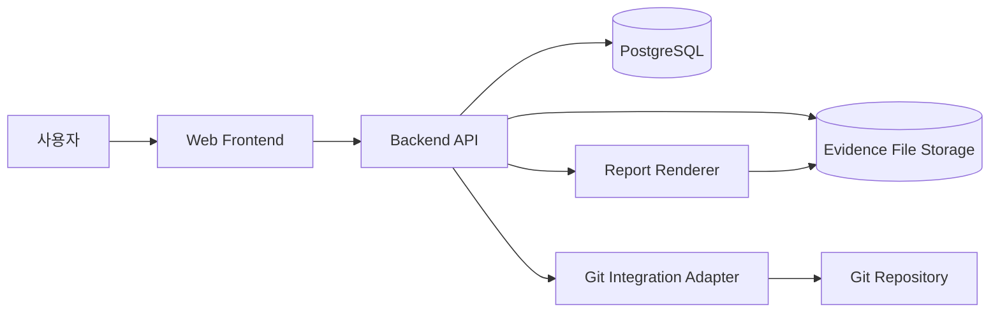
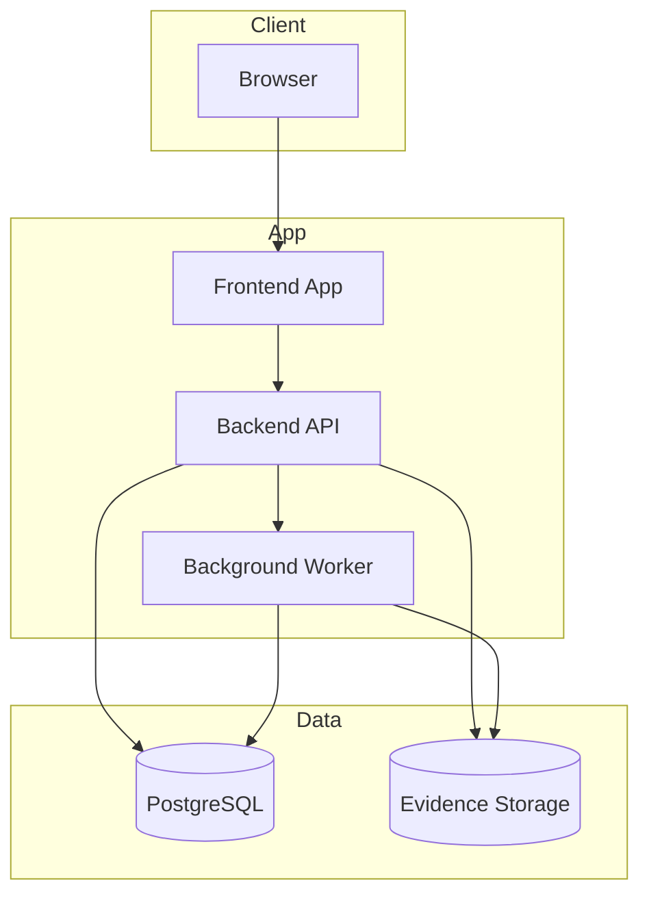
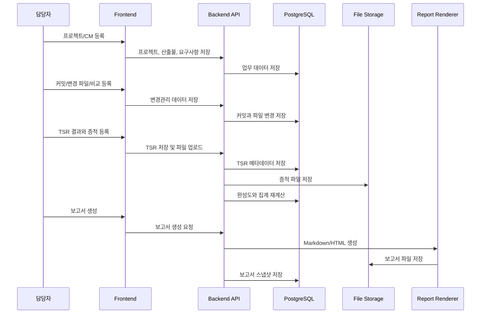
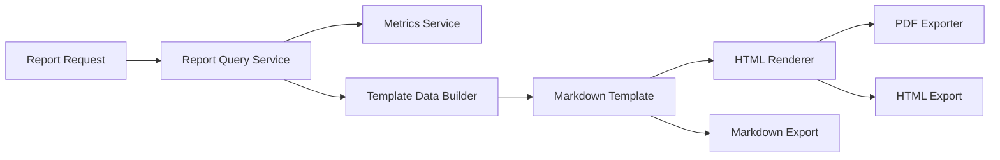

# CM 대시보드 프로젝트 아키텍처 설계

## 1. 아키텍처 목표

CM 대시보드는 프로젝트, CM 패키지, 커밋, 변경 파일, TSR 테스트케이스, 증적, 보고서를 하나의 추적 체계로 연결하는 내부 업무 시스템이다. 아키텍처는 다음 기준을 우선한다.

| 목표 | 설계 방향 |
|---|---|
| 추적성 | 프로젝트 -> CM 패키지 -> 커밋 -> 변경 파일 -> TSR -> 증적 흐름을 도메인 모델로 고정 |
| 집계 일관성 | 완성도, PASS율, 공수, 리소스 처리량은 서버 집계 계층에서 계산 |
| 입력 편의성 | 담당자가 빠르게 등록할 수 있도록 프로젝트/CM 상세 화면 중심으로 입력 동선 구성 |
| 보고 자동화 | 저장된 업무 데이터를 개인 실적 보고서와 프로젝트 최종 보고서로 재생성 |
| 확장성 | 1차 수기 등록 구조에서 Git 연동, PDF/Excel 내보내기, 알림으로 확장 가능 |
| 감사 가능성 | 삭제보다 상태 변경과 이력 보존을 우선 적용 |

## 2. 전체 구성



| 구성요소 | 책임 |
|---|---|
| Web Frontend | 대시보드, 목록/상세, 입력 폼, 보고서 미리보기 제공 |
| Backend API | 권한, 업무 규칙, CRUD, 집계, 보고서 생성, 파일 메타데이터 관리 |
| PostgreSQL | 업무 데이터, 집계 대상 데이터, 보고서 스냅샷 저장 |
| Evidence File Storage | 테스트 증적 이미지, 로그, 문서 파일 저장 |
| Report Renderer | Markdown/HTML/PDF 보고서 생성 |
| Git Integration Adapter | 2차 이후 커밋/파일 변경 내역 자동 수집 |

## 3. 권장 기술 스택

조직 표준이 정해지지 않았다는 전제에서 초기 구현 속도와 유지보수성을 기준으로 권장한다.

| 계층 | 권장 기술 | 선택 이유 |
|---|---|---|
| Frontend | Next.js 또는 React | 대시보드, 표, 필터, 상세 화면 구현에 적합 |
| UI | Tailwind CSS + shadcn/ui 또는 사내 디자인 시스템 | 업무형 UI를 빠르게 구성 |
| Chart | Recharts 또는 ECharts | 완성도, 테스트 분포, 리소스 집계 시각화 |
| Backend | FastAPI 또는 NestJS | CRUD/API 중심 업무 시스템에 적합 |
| ORM | SQLAlchemy 또는 Prisma/TypeORM | 명시적 모델과 마이그레이션 관리 |
| Database | PostgreSQL | 관계형 추적성, 집계, 뷰 구성에 적합 |
| File Storage | 로컬 파일 시스템, 이후 S3 호환 스토리지 | 증적 파일 저장과 확장 용이 |
| Report | Markdown 템플릿 + HTML/PDF 변환 | 기존 Markdown 업무 양식과 호환 |
| Auth | 세션/JWT, 이후 사내 SSO | 초기 단순 권한부터 확장 가능 |

초기 MVP는 `Frontend + Backend API + PostgreSQL + Local File Storage`로 구성하고, Git 연동과 PDF 변환은 별도 어댑터로 분리한다.

## 4. 배포 단위



| 배포 단위 | 설명 |
|---|---|
| Frontend App | 정적 또는 SSR 웹 애플리케이션 |
| Backend API | REST API, 인증/인가, 도메인 서비스 |
| Background Worker | 보고서 생성, 대용량 내보내기, Git 동기화 같은 비동기 작업 |
| PostgreSQL | 핵심 업무 데이터 |
| Evidence Storage | 증적 파일과 생성 보고서 파일 |

MVP에서는 Worker 없이 Backend API 내부 동기 처리로 시작할 수 있다. 보고서 생성과 Git 연동이 느려지면 Worker를 분리한다.

## 5. Backend 모듈 구조

```text
backend
 ├─ app
 │   ├─ core
 │   │   ├─ config
 │   │   ├─ auth
 │   │   ├─ permissions
 │   │   └─ errors
 │   ├─ modules
 │   │   ├─ dashboard
 │   │   ├─ projects
 │   │   ├─ deliverables
 │   │   ├─ requirements
 │   │   ├─ cm_packages
 │   │   ├─ commits
 │   │   ├─ file_changes
 │   │   ├─ tsr
 │   │   ├─ evidence
 │   │   ├─ reports
 │   │   └─ integrations
 │   ├─ shared
 │   │   ├─ pagination
 │   │   ├─ audit
 │   │   ├─ metrics
 │   │   └─ storage
 │   └─ main
 └─ migrations
```

| 모듈 | 책임 |
|---|---|
| dashboard | 전체 요약, 병목, 최근 활동, 차트 데이터 |
| projects | 프로젝트 CRUD, 마감, 프로젝트 요약 |
| deliverables | 작업 계획서, I/O 분석서, 요구사항 분석서, 최종 보고서 산출물 상태 |
| requirements | 요구사항 CRUD, CM 연결 |
| cm_packages | CM 패키지 CRUD, 개발 항목, CM 완성도 |
| commits | 커밋 등록, CM 연결 |
| file_changes | 변경 파일 등록, 변경 전/후 비교 |
| tsr | TSR 테스트케이스, 결과, 기기/OS, 공수 |
| evidence | 증적 업로드, 메타데이터, 누락 점검 |
| reports | 개인/프로젝트 보고서 생성, 제출, 승인, 내보내기 |
| integrations | Git 연동, 외부 저장소, 알림 같은 확장 기능 |

## 6. Frontend 화면 구조

```text
frontend
 ├─ app
 │   ├─ dashboard
 │   ├─ projects
 │   │   ├─ page
 │   │   └─ [projectId]
 │   ├─ cm-packages
 │   │   └─ [cmPackageId]
 │   ├─ commits
 │   ├─ file-changes
 │   ├─ tsr
 │   ├─ reports
 │   └─ settings
 ├─ components
 │   ├─ tables
 │   ├─ filters
 │   ├─ forms
 │   ├─ charts
 │   └─ layout
 └─ lib
     ├─ api
     ├─ formatters
     └─ validators
```

| 화면 | 주요 컴포넌트 |
|---|---|
| 전체 대시보드 | 요약 카드, 완성도 차트, TSR 결과 차트, 병목 목록, 최근 활동 |
| 프로젝트 목록 | 검색/필터, 프로젝트 테이블, 상태 배지, 완성도 게이지 |
| 프로젝트 상세 | 개요, 산출물, CM 목록, 요구사항, 리소스, 테스트, 보고서 탭 |
| CM 상세 | 기본 정보, 개발 항목, 커밋, 변경 파일, 변경 비교, TSR |
| 커밋/파일 변경 | 커밋 등록 폼, 파일 변경 테이블, 변경 비교 편집기 |
| TSR | 테스트케이스 목록, 결과 입력, 증적 업로드 |
| 보고서 | 보고서 생성 조건, 미리보기, 제출/승인, 내보내기 |
| 설정 | 사용자, 권한, 상태값, 점수 가중치 |

## 7. 도메인 경계

| 도메인 | 소유 데이터 | 외부 참조 |
|---|---|---|
| Project | 프로젝트, 멤버, 산출물 | 사용자 |
| CM Package | CM, 요구사항 연결, 개발 항목 | 프로젝트, 사용자 |
| Change Tracking | 커밋, 변경 파일, 변경 비교 | 프로젝트, CM |
| Test Management | TSR, 증적, 기기/OS, 결과 | 프로젝트, CM, 사용자 |
| Metrics | 완성도, PASS율, 리소스 점수 | 모든 업무 데이터 |
| Report | 보고서 스냅샷, 승인 상태 | 프로젝트, 사용자, 집계 결과 |

도메인 간 데이터 수정은 각 도메인 서비스 API를 통해서만 수행한다. 예를 들어 TSR 결과 변경 후 프로젝트 완성도 갱신은 `tsr` 모듈이 이벤트를 발행하고 `metrics` 또는 `dashboard` 집계 계층이 재계산한다.

## 8. 데이터 흐름

### 8.1 프로젝트 등록부터 보고서까지



### 8.2 집계 갱신 흐름

| 이벤트 | 재계산 대상 |
|---|---|
| 산출물 상태 변경 | 프로젝트 완성도 |
| CM 상태 변경 | CM 완료율, 프로젝트 완성도 |
| 개발 항목 상태 변경 | CM 완성도 |
| 커밋 등록 | 커밋 수, 리소스 점수, 최근 활동 |
| 변경 파일 등록 | 변경 파일 수, 영향도 파일 수, 리소스 점수 |
| 변경 비교 저장 | CM 완성도 |
| TSR 결과 변경 | 테스트 완료율, PASS율, 프로젝트/CM 완성도 |
| 증적 등록 | 증적 등록률, 품질 점검 |
| 보고서 승인 | 프로젝트 마감 가능 여부 |

초기에는 요청 처리 후 동기 재계산으로 충분하다. 데이터가 늘어나면 이벤트 테이블과 Worker 기반 비동기 재계산으로 전환한다.

## 9. 데이터 저장 전략

| 데이터 | 저장소 | 전략 |
|---|---|---|
| 업무 데이터 | PostgreSQL | 정규화 테이블, 외래키, 인덱스 |
| 집계 데이터 | PostgreSQL View 또는 Materialized View | MVP는 View, 성능 이슈 시 Materialized View |
| 증적 파일 | Local/S3 Storage | DB에는 파일명, 경로, 타입, 업로더만 저장 |
| 보고서 | DB + Storage | DB에는 생성 스냅샷, Storage에는 export 파일 저장 |
| 감사 이력 | audit_logs 테이블 | 주요 변경 전/후 값, 사용자, 시간 저장 |

증적 파일 경로는 원본 문서 기준과 맞춰 `/evidence/{CM번호}/{파일명}` 형태를 유지한다.

## 10. 인증과 권한

| 권한 | 가능 작업 |
|---|---|
| admin | 전체 생성/수정/삭제, 설정, 마감 해제, 보고서 승인 |
| leader | 담당 프로젝트 조회, 상태 확인, 보고서 승인 또는 반려 |
| member | 본인 프로젝트/CM/TSR 등록과 수정, 증적 업로드 |
| viewer | 조회와 보고서 열람 |

권한 검사는 API 계층에서 수행한다.

| 리소스 | 권한 체크 |
|---|---|
| Project | 관리자, 리더, 프로젝트 멤버 |
| CM Package | 관리자, 리더, CM 담당자 |
| Commit/File Change | 관리자, 리더, CM 담당자 |
| TSR/Evidence | 관리자, 리더, CM 담당자, 테스터 |
| Report | 관리자, 리더, 보고 대상자 |

## 11. 품질과 정합성

| 규칙 | 구현 위치 |
|---|---|
| 모든 커밋은 CM 패키지에 연결 | API validation, DB foreign key |
| 변경 파일은 커밋에 연결 | API validation, DB foreign key |
| PASS TSR은 증적 필요 | 품질 점검 서비스, 마감 검증 |
| FAIL TSR은 실제 결과와 재현 조건 필요 | API validation |
| 프로젝트 완료 전 모든 필수 산출물 확인 | 프로젝트 마감 서비스 |
| 완료 CM은 개발 항목과 TSR 정리 필요 | CM 상태 변경 서비스 |

마감 검증은 단순 저장 검증보다 엄격하게 운영한다. 입력 중간 단계에서는 임시 저장을 허용하되, 완료/승인/마감 시 누락 항목을 차단한다.

## 12. 보고서 아키텍처



| 단계 | 설명 |
|---|---|
| Query | 대상자, 기간, 프로젝트 조건에 맞는 원천 데이터 조회 |
| Metrics | 변경 파일 수, PASS율, 공수, 성과 지표 계산 |
| Template Data | 보고서 섹션별 데이터 구조 생성 |
| Markdown | 기존 업무 문서 형식과 호환되는 본문 생성 |
| HTML/PDF | 제출 또는 공유용 산출물 생성 |
| Snapshot | 보고 시점의 내용을 DB에 저장해 이후 데이터 변경과 분리 |

## 13. Git 연동 확장 구조

1차는 커밋 수기 등록을 기준으로 한다. 2차부터 Git 연동 어댑터를 추가한다.

| 기능 | 설명 |
|---|---|
| 저장소 등록 | 프로젝트별 Git remote URL과 기본 브랜치 등록 |
| 커밋 수집 | 특정 기간 또는 해시 범위의 커밋 목록 수집 |
| 파일 변경 수집 | 커밋별 changed files, additions, deletions 수집 |
| CM 매핑 | 커밋 메시지의 `CM-006` 같은 토큰으로 자동 연결 |
| 수동 보정 | 자동 매핑 실패 커밋을 사용자가 CM에 연결 |

Git 연동은 핵심 업무 데이터와 분리된 `integrations` 모듈에서 처리하고, 검증된 결과만 `commit_records`, `file_changes`에 반영한다.

## 14. 운영과 관측성

| 항목 | 설계 |
|---|---|
| 로그 | API 요청, 오류, 보고서 생성, 파일 업로드 로그 |
| 감사 로그 | 프로젝트/CM/TSR/보고서 상태 변경 이력 |
| 모니터링 | API 응답 시간, DB 쿼리 시간, 파일 업로드 실패율 |
| 백업 | PostgreSQL 일 단위 백업, 증적 파일 주기 백업 |
| 보존 정책 | 프로젝트 완료 후 업무 데이터와 증적 보존 기간 설정 |
| 장애 대응 | 증적 파일 업로드 실패 시 재시도와 실패 상태 표시 |

## 15. 환경 구성

| 환경 | 용도 |
|---|---|
| local | 개발자 로컬 개발 |
| dev | 통합 개발과 기능 확인 |
| staging | 운영 전 데이터/권한/보고서 검증 |
| production | 실제 업무 운영 |

환경 변수 예시:

```text
APP_ENV=local
DATABASE_URL=postgresql://...
STORAGE_DRIVER=local
STORAGE_BASE_PATH=./storage
JWT_SECRET=...
REPORT_EXPORT_PATH=./storage/reports
GIT_INTEGRATION_ENABLED=false
```

## 16. MVP 구현 순서

| 순서 | 구현 범위 | 완료 기준 |
|---|---|---|
| 1 | 프로젝트, 사용자, 권한 기본 구조 | 프로젝트 생성/조회 가능 |
| 2 | CM 패키지, 요구사항, 개발 항목 | 프로젝트 상세에서 CM 추적 가능 |
| 3 | 커밋, 변경 파일, 변경 비교 | CM 상세에서 변경 이력 확인 가능 |
| 4 | TSR, 증적 업로드 | 테스트 결과와 증적 누락 확인 가능 |
| 5 | 대시보드 집계 | 전체 요약, 완성도, PASS율 표시 |
| 6 | 보고서 생성 | 개인 실적 보고서 Markdown 생성 |
| 7 | 마감/승인 검증 | 누락 항목 차단 후 프로젝트 완료 처리 |

## 17. 아키텍처 결정 사항

| 결정 | 내용 |
|---|---|
| ADR-001 | 업무 데이터는 PostgreSQL에 정규화해 저장한다. |
| ADR-002 | 증적 파일은 DB에 직접 저장하지 않고 파일 스토리지에 저장한다. |
| ADR-003 | 완성도와 PASS율은 프론트엔드가 아닌 서버에서 계산한다. |
| ADR-004 | 보고서는 생성 시점 스냅샷을 저장한다. |
| ADR-005 | Git 연동은 MVP 이후 어댑터 모듈로 확장한다. |
| ADR-006 | 삭제는 기본적으로 soft delete 또는 상태 변경으로 처리한다. |

## 18. 리스크와 대응

| 리스크 | 대응 |
|---|---|
| 입력 항목이 많아 담당자 부담 증가 | CM 상세에서 커밋/변경 파일/TSR을 한 흐름으로 입력하게 구성 |
| 증적 파일 누락 | PASS 상태 저장 시 경고, 마감 시 차단 |
| 집계 기준 혼선 | API 및 집계 규칙 문서 기준으로 서버 계산 통일 |
| 보고서와 최신 데이터 불일치 | 보고서 스냅샷과 재생성 기능을 분리 |
| Git 자동 매핑 오류 | 자동 매핑 결과는 검토 후 반영 |
| 대시보드 성능 저하 | View로 시작하고 필요 시 Materialized View와 캐시 적용 |
