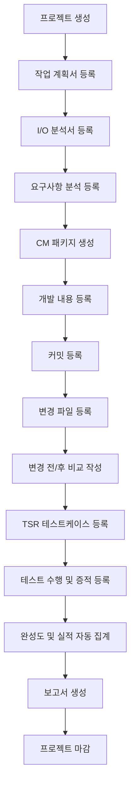

# CM 대시보드 프로젝트 설계서

## 1. 설계 목표

CM 대시보드는 프로젝트별 변경관리 업무를 정량화하고, CM 패키지 단위로 요구사항, 개발 변경사항, 커밋, 변경 리소스, TSR 테스트 결과, 증적, 공수, 최종 성과 보고서를 연결 관리하는 내부 업무 시스템이다.

핵심 목표는 다음과 같다.

| 목표 | 설명 |
|---|---|
| 업무 추적성 확보 | 프로젝트 -> CM 패키지 -> 커밋 -> 변경 파일 -> TSR 테스트케이스로 이어지는 추적 체계 구성 |
| 변경 영향도 관리 | 파일별 변경 유형, 영향도, 테스트 필요 여부를 기록하고 고영향도 리소스를 식별 |
| 검증 현황 가시화 | TSR 결과, PASS율, 미수행/진행중 테스트를 프로젝트와 CM 패키지 기준으로 확인 |
| 실적 자동 집계 | 변경 파일 수, 커밋 수, 테스트 수, 공수, 완성도, 정량 성과를 자동 산정 |
| 보고서 산출 | 개인 실적 보고서와 프로젝트 최종 보고서를 표준 양식으로 생성 |

## 2. 사용자와 권한

| 사용자 | 주요 역할 | 권한 |
|---|---|---|
| 관리자 | 프로젝트/사용자/기준값 관리 | 전체 조회, 생성, 수정, 삭제, 보고서 확정 |
| 프로젝트 리더 | 프로젝트 진행률과 품질 확인 | 담당 프로젝트 조회, 승인, 보고서 확인 |
| 담당자 | CM 패키지, 커밋, TSR, 증적 등록 | 본인 업무 생성/수정, 증적 업로드, 보고서 작성 |
| 조회자 | 현황 확인 | 대시보드와 보고서 읽기 |

초기 버전은 담당자와 리더 중심의 단순 권한으로 시작하고, 삭제/확정/마감 기능은 관리자 권한으로 제한한다.

## 3. 주요 화면

### 3.1 전체 대시보드

프로젝트 전체 상태를 한 화면에서 확인한다.

| 영역 | 표시 정보 |
|---|---|
| 요약 카드 | 전체 프로젝트 수, 진행중/완료 수, CM 패키지 수, 변경 파일 수, 커밋 수, TSR 수, 총 공수 |
| 완성도 | 프로젝트별 완성도 게이지, 평균 완성도 |
| 테스트 현황 | PASS/FAIL/진행중/미수행 비율, PASS율 |
| 병목 목록 | 완료율 낮은 프로젝트, FAIL 보유 CM, 증적 누락 TSR |
| 최근 활동 | 최근 등록 커밋, 변경 파일, TSR 결과 변경 |

### 3.2 프로젝트 목록

프로젝트를 검색하고 상태별로 필터링한다.

| 기능 | 설명 |
|---|---|
| 검색 | 프로젝트 ID, 프로젝트명, 담당자, 리더 |
| 필터 | 상태, 기간, 완성도 범위, 담당자 |
| 정렬 | 시작일, 종료일, 완성도, 변경 파일 수, PASS율 |
| 빠른 액션 | 프로젝트 상세 보기, 보고서 생성, 마감 처리 |

### 3.3 프로젝트 상세

프로젝트 기본 정보와 산출물 진행률, 연결된 CM 패키지를 확인한다.

| 탭 | 내용 |
|---|---|
| 개요 | 기본 정보, 기간, 담당자, 완성도, 산출물 상태 |
| CM 패키지 | CM 목록, 상태, 변경 파일 수, 커밋 수, TSR 수, 공수 |
| 요구사항 | 요구사항 분석, 우선순위, 연결 CM |
| 리소스 | 프로젝트 내 변경 파일 목록과 영향도 |
| 테스트 | 프로젝트 내 TSR 결과와 증적 누락 현황 |
| 보고서 | 개인 실적 보고서, 프로젝트 최종 보고서 |

### 3.4 CM 패키지 상세

변경관리의 핵심 화면이다.

| 섹션 | 내용 |
|---|---|
| 기본 정보 | 프로젝트, CM 번호, 제목, 상태, 담당자, 공수 |
| 요구사항 | 관련 요구사항 ID, 내용, 우선순위, 상태 |
| 개발 내용 | 개발 항목, 설명, 상태 |
| 커밋 | 커밋 해시, 메시지, 작업자, 작업일, 변경 파일 수 |
| 변경 리소스 | 파일명, 경로, 변경 유형, 영향도, 테스트 필요 여부 |
| 변경 비교 | 파일별 변경 전/변경 후, 변경 사유, 기대 효과 |
| TSR | 연결 테스트케이스, 결과, 기기, OS, 증적 경로 |

### 3.5 커밋 및 파일 변경관리

커밋을 등록하면 변경 파일을 연결하고, CM 패키지별 리소스 처리량을 집계한다.

| 입력 항목 | 필수 여부 |
|---|---|
| 프로젝트 ID | 필수 |
| CM 패키지 번호 | 필수 |
| 커밋 해시 | 필수 |
| 커밋 메시지 | 필수 |
| 작업자 | 필수 |
| 작업일 | 필수 |
| 변경 파일 목록 | 필수 |
| 연결 TSR | 선택 |

### 3.6 TSR 테스트케이스 관리

테스트케이스와 증적을 CM 패키지에 연결한다.

| 기능 | 설명 |
|---|---|
| 테스트케이스 등록 | TSR ID, 테스트명, 변경사항, 기대 결과, 기기, OS |
| 결과 관리 | PASS, FAIL, 진행중, 미수행 |
| 증적 등록 | 이미지 파일, 로그 파일, 실패 재현 조건 |
| 누락 점검 | PASS인데 증적 없음, FAIL인데 실제 결과 없음 같은 품질 점검 |

### 3.7 보고서

프로젝트 또는 개인 기준으로 실적 보고서를 생성한다.

| 보고서 | 내용 |
|---|---|
| 개인 실적 보고서 | 담당 프로젝트, CM 수, 변경 파일 수, 커밋 수, TSR 수, PASS율, 공수, 정량 성과 |
| 프로젝트 최종 보고서 | 프로젝트 개요, 요구사항 처리, 변경 리소스, 테스트 결과, 잔여 이슈, 최종 성과 |

## 4. 업무 프로세스



## 5. 상태 정의

| 도메인 | 상태 |
|---|---|
| 프로젝트 | 대기, 진행중, 검증중, 완료, 보류 |
| CM 패키지 | 대기, 진행중, 개발완료, 검증중, 완료, 보류 |
| 산출물 | 미작성, 진행중, 완료, 반려 |
| TSR | 미수행, 진행중, PASS, FAIL, 보류 |
| 보고서 | 미작성, 작성중, 제출, 승인, 반려 |

## 6. 완성도 산정 기준

프로젝트 완성도는 산출물, CM 패키지, TSR, 증적, 보고서 준비 상태를 반영한다.

| 항목 | 가중치 |
|---|---:|
| 작업 계획서 | 10% |
| I/O 분석서 | 10% |
| 요구사항 분석서 | 15% |
| CM 패키지 완료율 | 30% |
| TSR 완료율 | 20% |
| 증적 등록률 | 10% |
| 최종 보고서 | 5% |

공식:

```text
프로젝트 완성도 =
  작업 계획서 완료율 * 0.10
+ I/O 분석서 완료율 * 0.10
+ 요구사항 분석서 완료율 * 0.15
+ CM 패키지 완료율 * 0.30
+ TSR 완료율 * 0.20
+ 증적 등록률 * 0.10
+ 최종 보고서 완료율 * 0.05
```

## 7. 대시보드 품질 규칙

| 규칙 | 설명 |
|---|---|
| CM 없는 커밋 금지 | 모든 커밋은 반드시 CM 패키지에 연결 |
| 테스트 필요 파일 점검 | 영향도 높음 또는 테스트 필요 파일은 TSR 1건 이상 연결 권장 |
| PASS 증적 필수 | PASS 상태의 TSR은 증적 파일을 1개 이상 보유 |
| FAIL 사유 필수 | FAIL 상태는 실제 결과, 예상 결과, 재현 조건을 기록 |
| 프로젝트 완료 조건 | 모든 필수 산출물 완료, CM 완료, TSR 정리, 보고서 승인 |

## 8. 1차 구현 범위

| 우선순위 | 기능 |
|---|---|
| P0 | 프로젝트/CM/커밋/변경 파일/TSR CRUD |
| P0 | 전체 대시보드 집계 |
| P0 | 프로젝트 상세과 CM 상세 |
| P1 | 증적 파일 업로드와 누락 점검 |
| P1 | 개인 실적 보고서 생성 |
| P1 | 프로젝트 최종 보고서 생성 |
| P2 | Git 커밋 자동 연동 |
| P2 | Excel/PDF 내보내기 |

## 9. 권장 기술 구조

초기에는 관리형 업무 도구로 빠르게 만들 수 있는 웹 애플리케이션 구조를 권장한다.

| 계층 | 권장 구성 |
|---|---|
| Frontend | React 또는 Next.js, 표/필터/차트 중심 UI |
| Backend | FastAPI, NestJS, Spring Boot 중 조직 표준에 맞춰 선택 |
| Database | PostgreSQL |
| File Storage | 로컬 스토리지 또는 S3 호환 스토리지 |
| Auth | 사내 SSO 또는 간단한 계정/역할 기반 권한 |
| Report | Markdown/HTML 템플릿 기반 생성 후 PDF 변환 |

## 10. 개발 단계

| 단계 | 산출물 |
|---|---|
| 1단계 | 데이터 모델, 기본 CRUD, 대시보드 집계 |
| 2단계 | 변경 비교, TSR 증적, 품질 점검 |
| 3단계 | 보고서 생성, 마감/승인 흐름 |
| 4단계 | Git 연동, 외부 파일 내보내기, 알림 |
