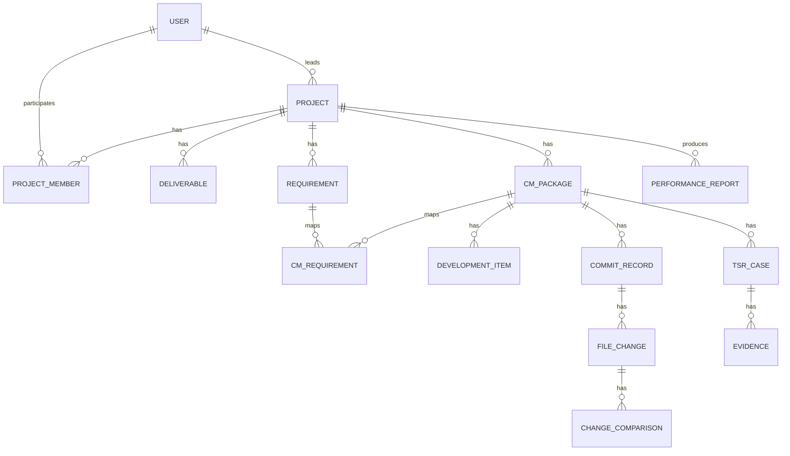

# 데이터 모델 설계

## 1. 엔터티 관계

## 2. 주요 테이블

### 2.1 users

| 컬럼 | 타입 | 설명 |
|---|---|---|
| id | uuid | 사용자 ID |
| name | varchar | 이름 |
| email | varchar | 이메일 |
| role | varchar | admin, leader, member, viewer |
| is_active | boolean | 사용 여부 |
| created_at | timestamp | 생성일 |

### 2.2 projects

| 컬럼 | 타입 | 설명 |
|---|---|---|
| id | uuid | 내부 ID |
| project_code | varchar | PRJ-001 형식의 프로젝트 ID |
| name | varchar | 프로젝트명 |
| leader_id | uuid | 프로젝트 리더 |
| owner_id | uuid | 주 담당자 |
| status | varchar | 대기, 진행중, 검증중, 완료, 보류 |
| start_date | date | 시작일 |
| end_date | date | 종료일 |
| progress_rate | numeric | 완성도 |
| total_md | numeric | 총 투입 공수 |
| description | text | 설명 |
| created_at | timestamp | 생성일 |
| updated_at | timestamp | 수정일 |

### 2.3 deliverables

| 컬럼 | 타입 | 설명 |
|---|---|---|
| id | uuid | 산출물 ID |
| project_id | uuid | 프로젝트 ID |
| type | varchar | work_plan, io_analysis, requirement_analysis, final_report |
| title | varchar | 산출물명 |
| status | varchar | 미작성, 진행중, 완료, 반려 |
| completion_rate | numeric | 완료율 |
| file_path | varchar | 첨부 또는 문서 경로 |
| note | text | 비고 |

### 2.4 requirements

| 컬럼 | 타입 | 설명 |
|---|---|---|
| id | uuid | 요구사항 ID |
| project_id | uuid | 프로젝트 ID |
| requirement_code | varchar | REQ-001 형식 |
| content | text | 요구사항 내용 |
| priority | varchar | 높음, 중간, 낮음 |
| status | varchar | 대기, 진행중, 완료, 보류 |

### 2.5 cm_packages

| 컬럼 | 타입 | 설명 |
|---|---|---|
| id | uuid | CM 패키지 ID |
| project_id | uuid | 프로젝트 ID |
| cm_code | varchar | CM-001 형식 |
| title | varchar | 제목 |
| owner_id | uuid | 담당자 |
| status | varchar | 대기, 진행중, 개발완료, 검증중, 완료, 보류 |
| changed_file_count | integer | 변경 파일 수 |
| commit_count | integer | 커밋 수 |
| tsr_count | integer | TSR 수 |
| md | numeric | 투입 공수 |
| progress_rate | numeric | CM 완성도 |
| created_at | timestamp | 생성일 |
| updated_at | timestamp | 수정일 |

### 2.6 cm_requirements

| 컬럼 | 타입 | 설명 |
|---|---|---|
| cm_package_id | uuid | CM 패키지 ID |
| requirement_id | uuid | 요구사항 ID |

### 2.7 development_items

| 컬럼 | 타입 | 설명 |
|---|---|---|
| id | uuid | 개발 항목 ID |
| cm_package_id | uuid | CM 패키지 ID |
| sequence | integer | 표시 순서 |
| title | varchar | 개발 항목 |
| description | text | 설명 |
| status | varchar | 대기, 진행중, 완료 |

### 2.8 commit_records

| 컬럼 | 타입 | 설명 |
|---|---|---|
| id | uuid | 커밋 ID |
| project_id | uuid | 프로젝트 ID |
| cm_package_id | uuid | CM 패키지 ID |
| commit_hash | varchar | 커밋 해시 |
| message | varchar | 커밋 메시지 |
| author_id | uuid | 작업자 |
| committed_at | date | 작업일 |
| change_type | varchar | 신규, 수정, 삭제, 혼합 |
| impact_level | varchar | 높음, 중간, 낮음 |

### 2.9 file_changes

| 컬럼 | 타입 | 설명 |
|---|---|---|
| id | uuid | 변경 파일 ID |
| project_id | uuid | 프로젝트 ID |
| cm_package_id | uuid | CM 패키지 ID |
| commit_record_id | uuid | 커밋 ID |
| file_name | varchar | 파일명 |
| file_path | varchar | 경로 |
| change_type | varchar | 신규, 수정, 삭제 |
| before_summary | text | 변경 전 요약 |
| after_summary | text | 변경 후 요약 |
| impact_level | varchar | 높음, 중간, 낮음 |
| test_required | boolean | 테스트 필요 여부 |

### 2.10 change_comparisons

| 컬럼 | 타입 | 설명 |
|---|---|---|
| id | uuid | 비교 ID |
| file_change_id | uuid | 변경 파일 ID |
| before_content | text | 변경 전 내용 |
| after_content | text | 변경 후 내용 |
| change_reason | text | 변경 사유 |
| expected_effect | text | 기대 효과 |

### 2.11 tsr_cases

| 컬럼 | 타입 | 설명 |
|---|---|---|
| id | uuid | TSR ID |
| tsr_code | varchar | TSR-001 형식 |
| project_id | uuid | 프로젝트 ID |
| cm_package_id | uuid | CM 패키지 ID |
| title | varchar | 테스트케이스명 |
| change_summary | text | 변경 사항 |
| expected_result | text | 예상 결과 |
| actual_result | text | 실제 결과 |
| device_name | varchar | 테스트 기기 |
| os_version | varchar | OS 버전 |
| mh | numeric | 투입 MH |
| md | numeric | 투입 MD |
| result | varchar | 미수행, 진행중, PASS, FAIL, 보류 |
| tested_at | date | 수행일 |
| tester_id | uuid | 테스터 |

### 2.12 evidence

| 컬럼 | 타입 | 설명 |
|---|---|---|
| id | uuid | 증적 ID |
| tsr_case_id | uuid | TSR ID |
| file_name | varchar | 증적 파일명 |
| file_path | varchar | 저장 경로 |
| evidence_type | varchar | screenshot, log, document |
| note | text | 비고 |
| uploaded_by | uuid | 등록자 |
| uploaded_at | timestamp | 등록일 |

### 2.13 performance_reports

| 컬럼 | 타입 | 설명 |
|---|---|---|
| id | uuid | 보고서 ID |
| report_type | varchar | personal, project_final |
| project_id | uuid | 프로젝트 ID, 개인 보고서는 nullable |
| subject_user_id | uuid | 보고 대상자 |
| period_start | date | 보고 시작일 |
| period_end | date | 보고 종료일 |
| status | varchar | 미작성, 작성중, 제출, 승인, 반려 |
| generated_content | text | 생성된 Markdown/HTML |
| approved_by | uuid | 승인자 |
| approved_at | timestamp | 승인일 |

## 3. 인덱스

| 테이블 | 인덱스 |
|---|---|
| projects | project_code unique, status, owner_id, leader_id |
| cm_packages | cm_code unique, project_id, status, owner_id |
| requirements | project_id, requirement_code |
| commit_records | commit_hash, project_id, cm_package_id |
| file_changes | project_id, cm_package_id, commit_record_id, file_path, impact_level |
| tsr_cases | project_id, cm_package_id, result |
| evidence | tsr_case_id |
| performance_reports | report_type, subject_user_id, project_id, status |

## 4. 정합성 규칙

| 규칙 | 설명 |
|---|---|
| 프로젝트 코드 중복 금지 | `project_code`는 전역 고유 |
| CM 코드 중복 금지 | `cm_code`는 전역 고유 또는 프로젝트 내 고유 정책 중 하나로 고정 |
| 커밋 해시 중복 제한 | 같은 CM 패키지 안에서 같은 해시 중복 등록 금지 |
| 변경 파일은 커밋 필수 | `file_changes.commit_record_id`는 필수 |
| TSR은 CM 필수 | 모든 TSR은 프로젝트와 CM 패키지에 연결 |
| PASS 증적 필수 | TSR 결과가 PASS인 경우 증적 1개 이상 필요 |
| FAIL 상세 필수 | TSR 결과가 FAIL인 경우 실제 결과와 재현 조건 기록 필요 |

## 5. 집계용 뷰

### 5.1 project_dashboard_view

프로젝트 목록과 대시보드에서 사용한다.

| 필드 | 산정 |
|---|---|
| cm_total | 프로젝트 내 CM 수 |
| cm_completed | 상태가 완료인 CM 수 |
| changed_file_total | 프로젝트 내 변경 파일 수 |
| commit_total | 프로젝트 내 커밋 수 |
| tsr_total | 프로젝트 내 TSR 수 |
| tsr_pass | PASS TSR 수 |
| tsr_fail | FAIL TSR 수 |
| evidence_missing | 증적 누락 TSR 수 |
| total_md | CM MD + TSR MD 또는 프로젝트 입력값 |

### 5.2 cm_dashboard_view

CM 패키지 목록과 상세에서 사용한다.

| 필드 | 산정 |
|---|---|
| requirement_total | 연결 요구사항 수 |
| development_done | 완료 개발 항목 수 |
| commit_total | 연결 커밋 수 |
| changed_file_total | 변경 파일 수 |
| high_impact_file_total | 영향도 높음 파일 수 |
| tsr_total | TSR 수 |
| tsr_pass | PASS TSR 수 |
| tsr_completion_rate | PASS/FAIL/보류를 완료 처리할지 정책에 따라 산정 |
